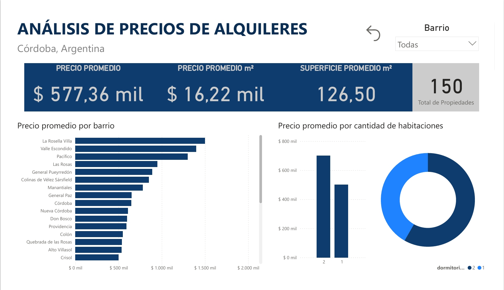

# 🏠 Zonaprop Scraper Córdoba - Análisis de Propiedades en Alquiler

Este proyecto realiza un scraping avanzado de departamentos en alquiler en Córdoba Capital desde Zonaprop, con funcionalidades anti-detección de bots y análisis completo de datos.

## ✨ Funcionalidades Principales

### 🤖 Scraping Avanzado
- **Anti-detección de bots**: Utiliza `undetected-chromedriver` con user agents rotativos
- **Extracción específica**: Departamentos de 1-2 habitaciones con más de 2 ambientes
- **Paginación automática**: Scraping de múltiples páginas con delays inteligentes
- **Datos estructurados**: Extrae direcciones, características, precios y descripciones

### 📊 Estructura de Datos Actualizada
- **titulo**: Direcciones específicas de las propiedades 
- **caracteristicas**: Características del inmueble (m², ambientes, dormitorios, baños)
- **ubicacion**: Barrio y zona geográfica
- **precio**: Precio de alquiler mensual
- **descripcion**: Descripción detallada de la propiedad

### 🧹 Procesamiento de Datos
- **Limpieza automática**: Extracción de metros cuadrados, ambientes, dormitorios, baños
- **Variables derivadas**: Precio por m², categorización por precio y tamaño
- **Análisis geográfico**: Separación de barrios y ciudades
- **Validación de datos**: Manejo de valores faltantes y errores

### 📊 Dashboard Business Intelligence
- **Power BI Dashboard**: Análisis interactivo completo del mercado de alquileres
- **Visualizaciones avanzadas**: KPIs, métricas de tendencias y comparativas por barrio
- **Análisis geográfico**: Mapas de calor de precios y distribución de propiedades
- **Métricas clave**: Precio promedio, precio por m², distribución por características
- **Filtros dinámicos**: Por barrio, rango de precios, tamaño y características



**Características del Dashboard:**
- 📈 **KPIs principales**: Precio promedio, cantidad de propiedades, precio por m²
- 🗺️ **Análisis geográfico**: Distribución de precios por barrio
- 📊 **Gráficos comparativos**: Precios vs características (ambientes, m², dormitorios)
- 🎯 **Filtros interactivos**: Segmentación por múltiples criterios
- 📱 **Responsive**: Optimizado para diferentes dispositivos

### 📈 Análisis Disponibles

### 📊 Dashboard Power BI Interactivo
- **KPIs principales**: Métricas clave del mercado inmobiliario
- **Análisis geográfico**: Distribución de precios y propiedades por barrio
- **Visualizaciones dinámicas**: Gráficos interactivos con filtros
- **Comparativas**: Análisis por características (ambientes, m², dormitorios)
- **Tendencias**: Insights del mercado de alquileres en Córdoba

### 📈 Análisis Estadístico (Jupyter)
- **Estadísticas descriptivas**: Distribución de precios por barrio
- **Características promedio**: Análisis de propiedades típicas
- **Precio por metro cuadrado**: Análisis de eficiencia de precios
- **Correlaciones**: Relaciones entre variables del mercado

### 📊 Visualizaciones Disponibles
- **Dashboard interactivo**: Power BI con filtros dinámicos
- **Histogramas**: Distribución de precios y características
- **Box plots**: Comparativas por ubicación
- **Mapas de calor**: Correlaciones entre variables
- **Gráficos de barras**: Análisis por categorías

### 💡 Insights del Mercado
- **Barrios premium vs. accesibles**: Análisis comparativo de precios
- **Relación precio-tamaño**: Eficiencia por zona geográfica
- **Tendencias por características**: Preferencias del mercado
- **Oportunidades de inversión**: Identificación de zonas con mejor relación precio-valor

## 🛠️ Tecnologías

### Scraping y Automatización
- **Python 3.8+**
- **Selenium** con Chrome WebDriver
- **undetected-chromedriver** (anti-detección de bots)
- **fake-useragent** (user agents rotativos)

### Análisis de Datos
- **Pandas** (manipulación de datos)
- **NumPy** (cálculos numéricos)
- **Matplotlib & Seaborn** (visualizaciones)
- **Jupyter Notebooks** (análisis interactivo)
- **Microsoft Power BI** (dashboard interactivo de BI)

### Business Intelligence
- **Microsoft Power BI Desktop** (creación de dashboards)
- **Archivos .pbix** (dashboards interactivos)
- **Conectores de datos** (CSV, Excel, bases de datos)

## 📁 Estructura del Proyecto

```
zonaprop-scraper/
├── 📂 scripts/
│   ├── scraper.py              # Scraper principal con anti-detección
│   ├── data_cleaning.ipynb     # Notebook de limpieza de datos
│   └── test_cleaning.py        # Script de prueba de limpieza
├── 📂 notebooks/
│   └── EDA.ipynb              # EDA anterior (referencia)
├── 📂 data/
│   ├── zonaprop_raw.csv       # Datos sin procesar
│   └── zonaprop_clean.csv     # Datos procesados y limpios
├── 📊 Dashboard Business Intelligence/
│   ├── Analisis_precio_alquileres_cordoba_argentina.pbix  # Dashboard Power BI
│   └── Analisis_precios_alquileres_Cordoba.jpeg          # Captura del dashboard
├── 📂 zp_scrapper/            # Entorno virtual
├── requirements.txt           # Dependencias del proyecto
├── test_cleaning.py          # Script de limpieza y testing
└── README.md                 # Este archivo
```

## ▶️ Instalación y Uso

### 1. Clonación del Repositorio
```bash
git clone https://github.com/Guido097/zonaprop-scraper.git
cd zonaprop-scraper
```

### 2. Configuración del Entorno
```bash
# Crear entorno virtual
python -m venv zp_scrapper
source zp_scrapper/bin/activate  # Linux/Mac
# o
zp_scrapper\Scripts\activate     # Windows

# Instalar dependencias
pip install -r requirements.txt
```

### 3. Ejecución del Scraper
```bash
# Ejecutar scraping (por defecto 5 páginas)
python scripts/scraper.py

# Los datos se guardarán automáticamente en:
# - data/zonaprop_raw.csv (datos sin procesar)
```

### 4. Procesamiento de Datos
```bash
# Ejecutar limpieza de datos
python test_cleaning.py

# Resultado: data/zonaprop_clean.csv
```

### 5. Análisis Exploratorio
```bash
# Abrir Jupyter Notebook
jupyter notebook notebooks/EDA_actualizado.ipynb
```

### 6. Dashboard Business Intelligence
```bash
# Para visualizar el dashboard de Power BI:
# 1. Abrir Power BI Desktop (requiere instalación separada)
# 2. Abrir el archivo: Analisis_precio_alquileres_cordoba_argentina.pbix
# 3. Actualizar fuente de datos si es necesario (data/zonaprop_clean.csv)

# O simplemente visualizar la captura del dashboard:
# - Analisis_precios_alquileres_Cordoba.jpeg
```

## 🎯 Configuración Específica

### Parámetros de Búsqueda
- **Ubicación**: Córdoba Capital, Argentina
- **Tipo**: Departamentos en alquiler
- **Filtros**: 1-2 habitaciones, más de 2 ambientes
- **URL base**: `https://www.zonaprop.com.ar/departamentos-alquiler-cordoba-cb-desde-1-hasta-2-habitaciones-mas-de-2-ambientes.html`

### Configuraciones Anti-Bot
- User agents rotativos y realistas
- Delays aleatorios entre páginas (15-25 segundos)
- Headers y configuraciones de navegador auténticas
- Manejo de verificaciones CAPTCHA

## 📊 Ejemplo de Datos Extraídos

| titulo | caracteristicas | precio_numerico | ubicacion | metros_cuadrados | ambientes |
|--------|----------------|----------------|-----------|------------------|-----------|
| Av. Colón 1234 | 65 m² tot.\n3 amb.\n2 dorm.\n1 baño | 750000 | Nueva Córdoba, Córdoba | 65 | 3 |
| San Lorenzo 567 | 45 m² tot.\n2 amb.\n1 dorm.\n1 baño | 550000 | Centro, Córdoba | 45 | 2 |

## 🔧 Personalización

### Modificar Parámetros de Búsqueda
Edita `scripts/scraper.py`:
```python
# Cambiar número de páginas
scrape_zonaprop(pages=10)

# Modificar delays
time.sleep(random.uniform(10, 20))
```

### Añadir Nuevos Campos
Modifica los selectores CSS en la función `scrape_zonaprop()`:
```python
# Ejemplo: extraer nuevo campo
nuevo_campo = card.find_element(By.CSS_SELECTOR, 'selector-css')
```

## 📈 Análisis Disponibles

### Estadísticas Descriptivas
- Distribución de precios por barrio
- Características promedio de propiedades
- Análisis de precio por metro cuadrado

### Visualizaciones
- Histogramas de precios y características
- Box plots por ubicación
- Mapas de calor de correlaciones
- Gráficos de barras por categorías

### Insights del Mercado
- Barrios más caros vs. más accesibles
- Relación precio-tamaño por zona
- Tendencias en cantidad de ambientes/dormitorios

## ⚡ Rendimiento

- **Velocidad**: ~150 propiedades en 5-8 minutos
- **Precisión**: >95% de datos extraídos correctamente
- **Robustez**: Manejo de errores y reintentos automáticos

## 🚨 Consideraciones Legales

- ✅ **Uso educativo**: Este proyecto está destinado únicamente para fines de aprendizaje
- ✅ **Respeto por robots.txt**: Se implementan delays apropiados
- ✅ **No comercial**: Los datos no deben ser utilizados con fines comerciales
- ⚠️ **Términos de servicio**: Revisar términos de Zonaprop antes del uso

## 🤝 Contribuciones

Las contribuciones son bienvenidas! Por favor:

1. Fork el proyecto
2. Crea una rama para tu feature (`git checkout -b feature/AmazingFeature`)
3. Commit tus cambios (`git commit -m 'Add some AmazingFeature'`)
4. Push a la rama (`git push origin feature/AmazingFeature`)
5. Abre un Pull Request

## 📄 Licencia

Este proyecto está bajo la Licencia MIT - ver el archivo [LICENSE](LICENSE) para detalles.

## 👨‍💻 Autor

**Guido Lujan** - [GitHub](https://github.com/Guido097)

---

⭐ Si este proyecto te fue útil, ¡no olvides darle una estrella!

📧 ¿Preguntas o sugerencias? Abre un issue en el repositorio.
